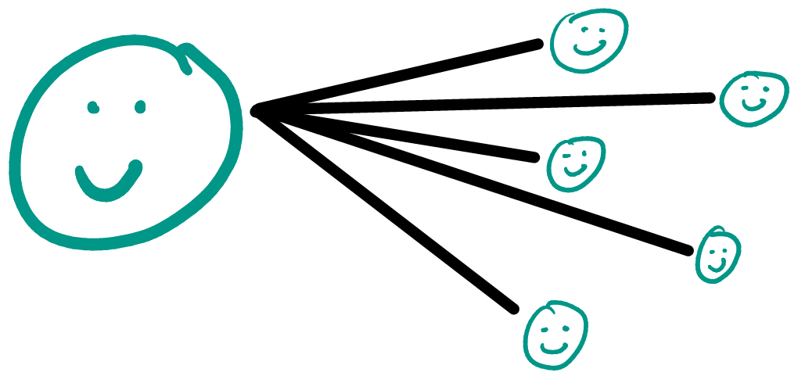
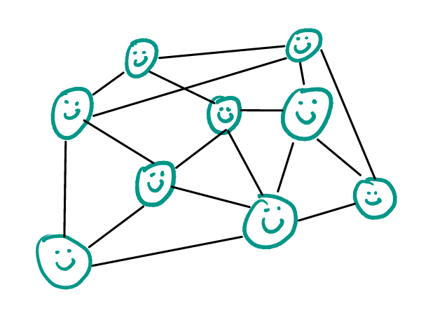

_crossposted to [snc.digpins.org](https://snc.digpins.org/uncategorized/contagions-in-twitter-vs-blogs-vs-podcasting/)_

After experiencing Nicky Case's [The Wisdom and Madness of Crowds](https://ncase.me/crowds/) I started thinking about the what a particular method of communication could be important in spreading complicated ideas or concepts. The stuff Case talks about in *The Wisdom and Madness of Crowds* is not specific to any particular online or offline or type of media, so I'm going to apply this type of thinking to Twitter, blogging, and podcasting and see if I can come up with any interest comparisons or contrasts.

## Twitter

As Case points out, a large network with tons of connections between all of its members can lead to group think, which can make it difficult for complex, new, or challening ideas to gain traction. Platforms like Twitter can exacerbate this problem, with its 280 character limit. In addition to this retweeting makes it easy to copy and paste an idea on a large scale. This means that some things can get taken out of context and short and simple ideas can go viral easily.

## Blogging

Most blogs sites would look very different as a network than a network on Twitter. Blog sites typically have less authors than readers[^1] so these networks so I'll call these one-to-many networks:

This is very different from the the networks we usually see in Case's examples:

You might say that one-to-many networks aren't really networks at all, and are closer to a form of broadcast communication. That might be true, but it's at least still useful for me to compare the two using Case's language around networks and crowds, so I'm going to keep rolling with this one-to-many networks thing.[^2]

Blog sites do often have a comment section, where many people can participate, but these sections usually aren't featured as prominently on the page, so they really feel more like a sub-network than a network to me.

In contrast to Twitter, blogs also have all the space the author needs to get a complicated idea across. The only real limitation here is how long you can hold an audiences attention.

## Podcasts

Podcasts as a network have very similar one-to-many structure to blogs. Typically a  podcast has a few hosts and a large amount of listeners. Podcasts cannot offer comments sections like blogs do, although many podcast hosts welcome audience feedback/follow-up and will incorporate that into the show. What makes that different from blogs though is that that audience feedback is usually behind by one episode[^3], as the audience won't have anything to react to until after the podcast episode has been published. Therefore feedback usually for a given episode of a podcast will, at the earliest, show up in time to record the next episode. 

Podcasts offer plenty of time for the creator to communicate a complex idea, as its not uncommon to see a runtime of 1 - 2 hours. On top of this, because podcasts usually have more than one host, the audience gets to here two or more people have a discussion about an idea, which can make it easier for the listener to relate to the discussion and feel like they're a part of the conversation (even though they aren't really in that moment). Most of my favorite podcasts have a format that can essentially be summed up as "Three friends talk about a topic they all have in common." For me this means that when I hear one of my favorite podcast hosts recommend something, it feels more like I'm a part of their network, and so that recommendation is more valuable to me.

[^1]: Successful ones do anyway. For my purposes I am going to say that in order for a blog to be a network, it neads to have some kind of audience.
[^2]:   
_[Source](https://gph.is/2bLJIZ0)_
[^3]: Unless the podcast is broadcasted live while they record. Some hosts will choose to do this and offer a [live chat room.](https://www.relay.fm/live)