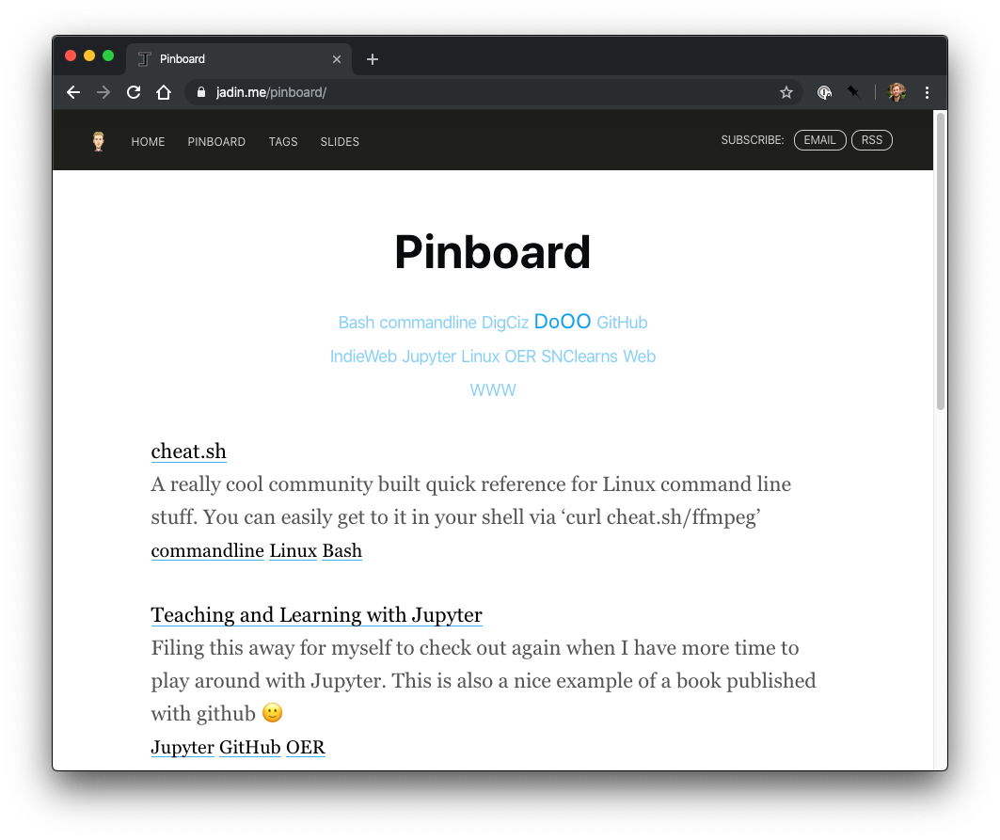
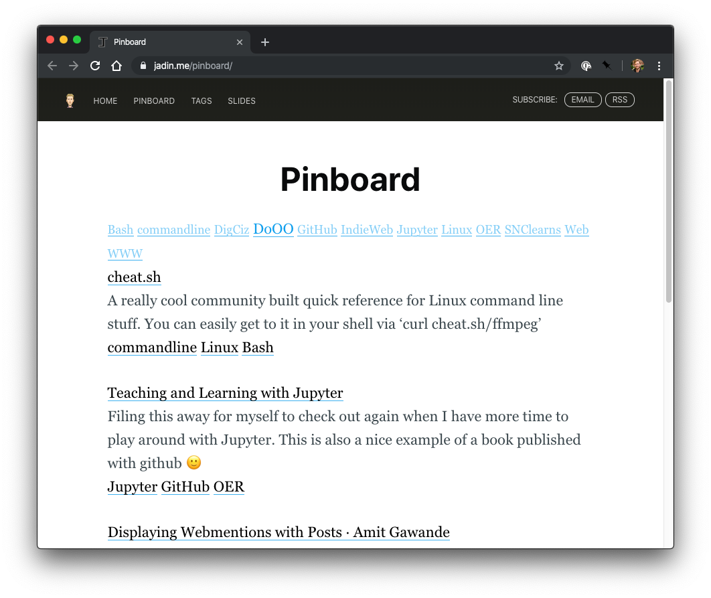

I've been messing around with Pinboard lately for social bookmarking and I’ve been really impressed with its archiving features and all the excellent iOS clients for it. I’ve also messed around with getting my bookmarks showing up on my domain! I've had some people ask exactly how I've integrated Pinboard with this site, so here's what I've done.

<figure>
    
    <figcaption>
        The finished product.
    </figcaption>
</figure>


At [pinboard.in/resources](https://pinboard.in/resources) you can find the [Linkroll](https://pinboard.in/resources/linkroll) and [Tag cloud](https://pinboard.in/resources/tag_cloud/) widget, under Javascript Widgets. Both of those pages give you a few options you can configure, and a script that you can embed onto a page. For this site I use Ghost, so I was able to add an HTML block to a page, then paste in the script for my tag cloud:

```html
<script language="javascript" src="https://pinboard.in/badge?user=taylorjadin&num=40&color=040069998999-040069993000&size=12-30"></script>
```

And my linkroll:

```html
<script language="javascript" src="https://pinboard.in/badge?user=taylorjadin&num=40&color=040069998999-040069993000&size=12-30"></script>
```

If you force https on your site like I do you will need to change the `src="http` to `src="https` for both the tag cloud and  the linkroll scripts after copying the code from the pinboard site, otherwise the script will not work (web browsers will not run an insecure script form a secure website).

For the linkroll, it will also ask you to add a few lines of CSS to your stylesheet. I added this using the code injection feature on the page in Ghost, but you could add this to your global style sheet, or in Wordpress use the "Additional CSS" area in the customizer.

```css
.pin-title {
    font-size: 1em;
    text-decoration: none;
    color: #00a
    }
.pin-description {
    color: #555;
    }
.pin-tag {
    color: #18c;
    text-decoration: none;
    font-size:0.9em;
    }
```

This technically worked, but the tag cloud didn't look quite right:



If you use the inspector you'll notice that there isn't a good class or id to easily use in CSS to select the tag cloud and make style changes, so I went back to my tag cloud script that was embedded, and I wrapped the whole script in a `<div>` and gave it the class `pinboard-tags` like this:

```html
<div class="pinboard-tags">
<script language="javascript" src="https://pinboard.in/badge?user=taylorjadin&num=40&color=86CFF7-109FED&size=18-22"></script>
</div>
```

From here then I was able to use CSS to center the text, modify the max-width, add some spacing on the bottom, remove underlining on the links, and change my font.

```css
.pinboard-tags {
        text-align: center;
        max-width: 360px;
        padding-bottom: 30px;
        }
.pinboard-tags > a {
  box-shadow: none;
  font-family: Helvetica Neue,sans-serif;
  }
```

Next, I'd like to experiment with some way to use javascript to wrap each bookmark post to be properly marked up as an [Indieweb bookmark post](https://indieweb.org/bookmark)!