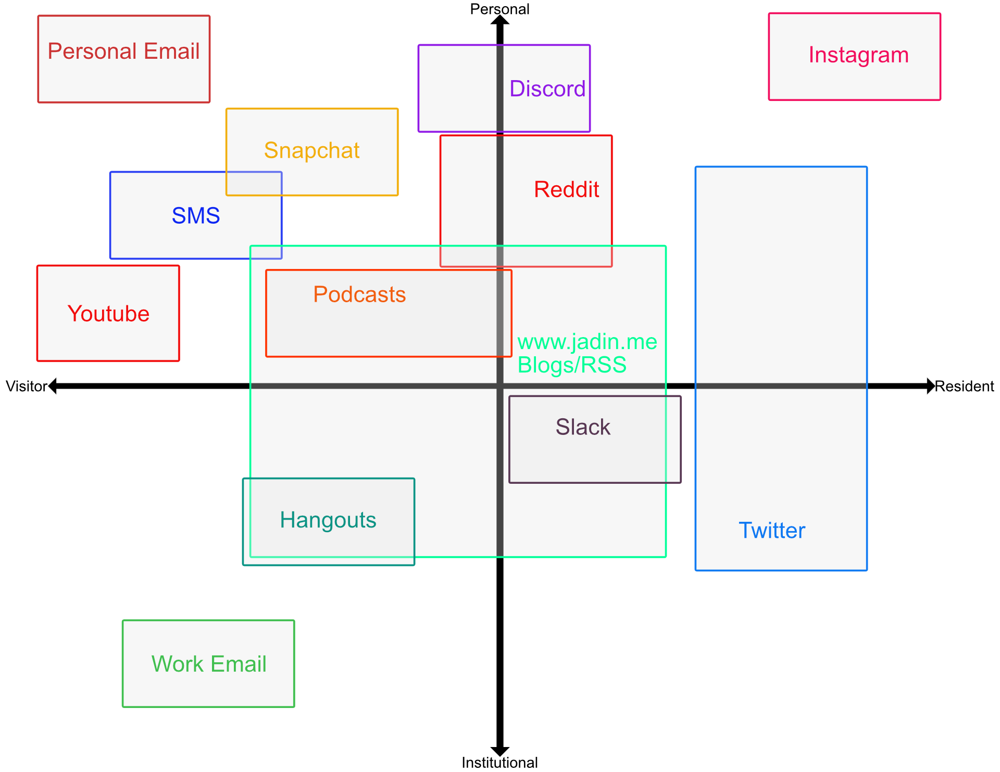

_crossposted to [snc.digpins.org](https://snc.digpins.org/vr-map-2/)_

I am participating in [#DigPINS](https://digpins.org/) and our first week is about digital identity. We were asked to create a [Visitors and Residents Map](http://daveowhite.com/vandr/) which is a nice visual way of describing the way we interact and engage with different tools on the web.

Here is mine:

I chose to include Youtube and Podcasts on this map, because even though I consume that stuff more than I create it, I have dabbled with producing [podcasts](https://soundcloud.com/jadinapproved) and Youtube videos (for work).

This also makes the block representing blogging and my own website kind of confusing. I do have my own domain (hey you're on it!) and it is one of the firs things you will encounter when you Google my name, but I haven't written much here. In addition to this I spend quite a bit of time reading other blogs and newsfeeds using an [RSS reader](https://blog.timowens.io/link-sharing-through-tiny-tiny-rss/), so in total I spend much more time reading than I do writing which is why Blogs and RSS are in all four of the quadrants of my map.